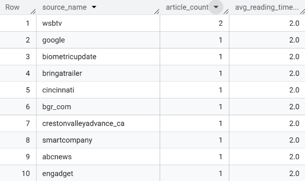
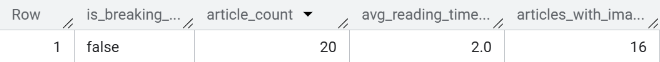
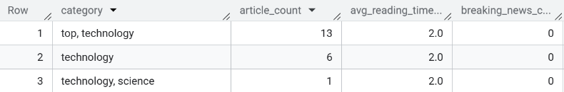
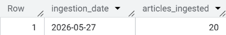

# Task 2: News Data Pipeline

A modular Python pipeline that fetches news articles from [NewsData.io](https://newsdata.io), transforms the data, and loads it into Google BigQuery.

---

## Why NewsData.io?

NewsAPI (the originally considered option) requires a work email for signup. NewsData.io provides equivalent structured news data on a free tier with no such restriction. The data structure is rich — articles include title, description, source, category, country, language, keywords, and publish date — making it ideal for demonstrating meaningful transformation logic.

---

## Project Structure

```
task2-pipeline/
├── main.py            # Entry point — runs the full pipeline
├── fetch.py           # Fetches data from NewsData.io API
├── transform.py       # Cleans and enriches raw data
├── load.py            # Loads transformed data into BigQuery
├── config.py          # All parameters in one place
├── requirements.txt   # Python dependencies
└── queries/
    └── summary.sql    # SQL queries to analyse the stored data
```

---

## How to Run

### 1. Clone the repository

```bash
git clone <your-repo-url>
cd task2-pipeline
```

### 2. Install dependencies

```bash
pip install -r requirements.txt
```

### 3. Set up Google Cloud authentication

This pipeline uses Application Default Credentials (ADC). Run the following and log in with your Google account:

```bash
gcloud auth application-default login
```

If you don't have the gcloud CLI installed:
👉 https://cloud.google.com/sdk/docs/install

### 4. Run the pipeline

```bash
python main.py
```

You will see logs in the terminal showing each step: fetch → transform → load.

---

## BigQuery Setup

- **Project ID:** `affable-framing-464607-b9`
- **Dataset:** `news_pipeline`
- **Table:** `articles`

The pipeline automatically creates the dataset and table on first run if they don't exist. No manual setup needed.

### Table Schema

| Field | Type | Description |
|-------|------|-------------|
| article_id | STRING | Unique ID from NewsData.io |
| title | STRING | Article headline |
| description | STRING | Article summary |
| source_name | STRING | Publisher/source name |
| source_url | STRING | Link to the article |
| author | STRING | Author(s), comma-separated |
| language | STRING | Language code (e.g. "en") |
| country | STRING | Country of origin |
| category | STRING | News category |
| keywords | STRING | Keywords, comma-separated |
| image_url | STRING | Thumbnail image URL |
| published_at | STRING | Original publish timestamp |
| reading_time_seconds | INTEGER | **Derived:** Estimated reading time |
| is_breaking_news | BOOLEAN | **Derived:** True if title contains breaking keywords |
| has_image | BOOLEAN | **Derived:** True if article has an image |
| has_description | BOOLEAN | **Derived:** True if description is present |
| ingested_at | STRING | Timestamp when pipeline ran |

### Derived Fields (Added by This Pipeline)

These fields do not come from the API — they are calculated during transformation:

- **`reading_time_seconds`** — Estimated from word count of the description/content at 200 words per minute. Useful for content editors who want to understand depth of coverage.
- **`is_breaking_news`** — Flags articles whose titles contain words like "breaking", "urgent", "alert", or "developing". Useful for editorial prioritisation.
- **`has_image`** and **`has_description`** — Boolean quality flags. Useful for filtering out incomplete records downstream.

---

## SQL Summary Queries

See `queries/summary.sql` for the full queries. Key examples:

### Top sources by article count

```sql
SELECT
    source_name,
    COUNT(*) AS article_count,
    ROUND(AVG(reading_time_seconds), 0) AS avg_reading_time_seconds
FROM `affable-framing-464607-b9.news_pipeline.articles`
WHERE source_name IS NOT NULL AND source_name != ''
GROUP BY source_name
ORDER BY article_count DESC
LIMIT 10;
```
**Output:**


### Breaking news summary

```sql
SELECT
    is_breaking_news,
    COUNT(*) AS article_count,
    ROUND(AVG(reading_time_seconds), 0) AS avg_reading_time_seconds,
    COUNTIF(has_image = TRUE) AS articles_with_image
FROM `affable-framing-464607-b9.news_pipeline.articles`
GROUP BY is_breaking_news;
```
**Output:**


### Query 3: Articles by Category
```sql
SELECT
    category,
    COUNT(*) AS article_count,
    ROUND(AVG(reading_time_seconds), 0) AS avg_reading_time_seconds,
    COUNTIF(is_breaking_news = TRUE) AS breaking_news_count
FROM `affable-framing-464607-b9.news_pipeline.articles`
WHERE category IS NOT NULL AND category != ''
GROUP BY category
ORDER BY article_count DESC;
```
**Output:**


### Query 4: Daily Ingestion Trend
```sql
SELECT
    DATE(ingested_at) AS ingestion_date,
    COUNT(*) AS articles_ingested
FROM `affable-framing-464607-b9.news_pipeline.articles`
GROUP BY ingestion_date
ORDER BY ingestion_date DESC;
```
**Output:**


---

## Running in Production

### How would you schedule this pipeline?

On GCP, I would use **Cloud Scheduler** to trigger a **Cloud Run Job** (or Cloud Function) on a defined schedule (e.g. every 6 hours). This keeps everything within the GCP ecosystem and requires no always-on server.

Alternatively, for a simpler setup, a **cron job** on a Linux VM would work:

```bash
0 */6 * * * /usr/bin/python3 /path/to/main.py >> /var/log/news_pipeline.log 2>&1
```

### How would you know if it failed?

- The pipeline logs all steps with timestamps and error messages.
- In production, I would route logs to **Google Cloud Logging** and set up a **log-based alert** that triggers an email or Slack notification when an ERROR-level log appears.
- I would also monitor the BigQuery table row count after each run — a sudden drop signals a silent failure.

### What would you change if data volume scaled 10x?

- Switch from `insert_rows_json` (streaming inserts) to **batch loading via GCS** (write to a Cloud Storage file first, then use a BigQuery load job) — it's more efficient and cheaper at scale.
- Add **pagination** to the API fetch step, since the free tier only returns 50 results per call.
- Move transformation logic to **Dataflow** or **dbt** if the cleaning logic becomes complex.
- Add **deduplication logic** in BigQuery using `article_id` as a unique key to prevent duplicate rows on re-runs.

---

## Decisions and Trade-offs

- **Why not use `.env` for secrets?** For simplicity in this assessment, config is in `config.py`. In production, API keys would be stored in **Secret Manager** and injected as environment variables — never hardcoded.
- **Why store lists as comma-separated strings?** BigQuery Sandbox does not support `REPEATED` fields with streaming inserts. Storing as strings is a practical workaround within sandbox constraints.
- **What I would revisit with more time:** Add a deduplication step before loading, implement incremental loads (only fetch articles newer than the last run), and write unit tests for the transform functions.
